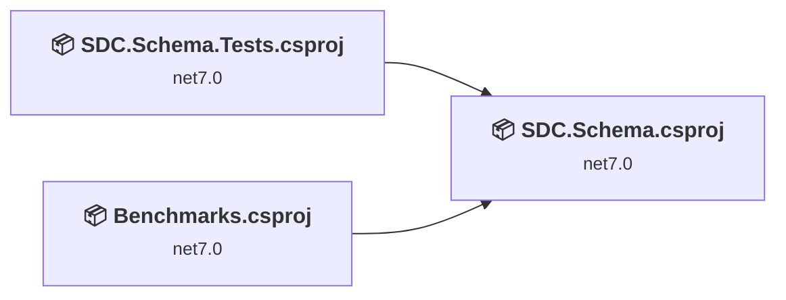
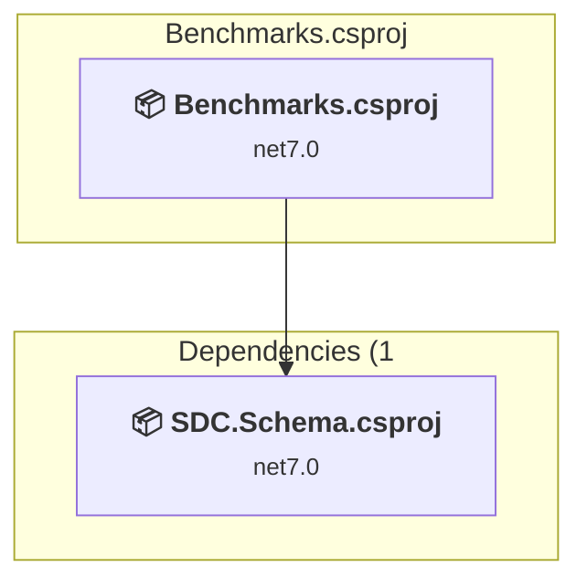
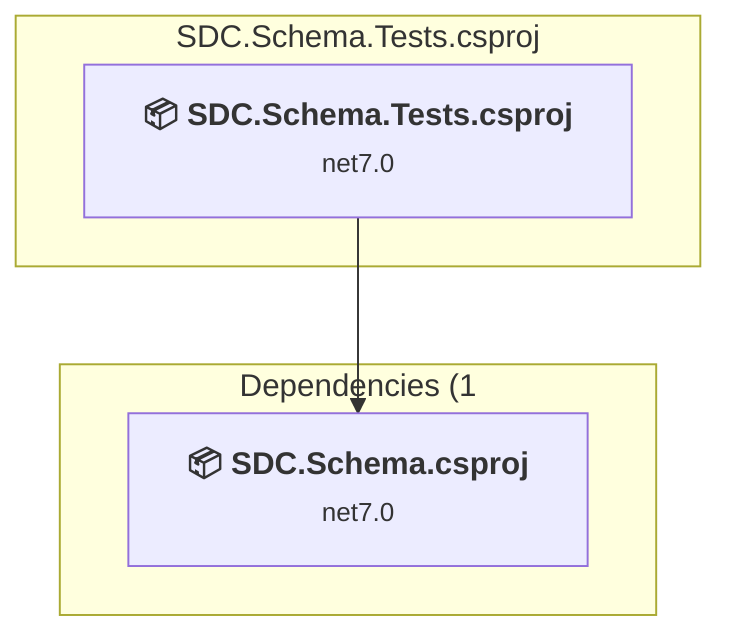
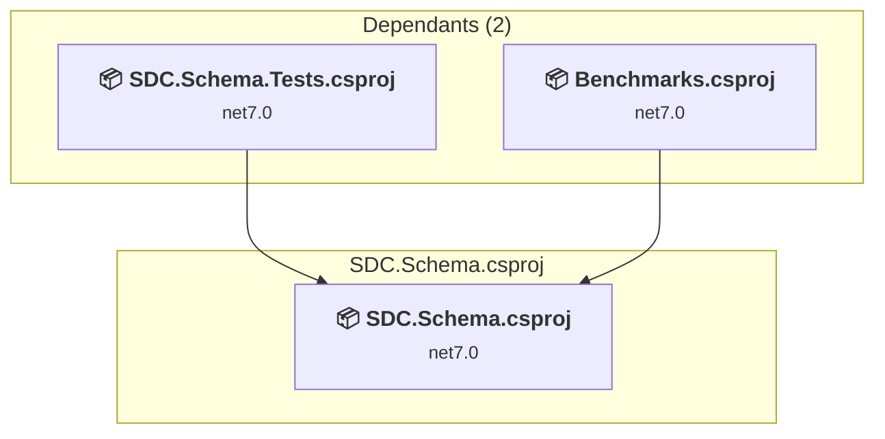

# Projects and dependencies analysis

This document provides a comprehensive overview of the projects and their dependencies in the context of upgrading to .NETCoreApp,Version=v11.0.

## Table of Contents

- [Executive Summary](#executive-Summary)
  - [Highlevel Metrics](#highlevel-metrics)
  - [Projects Compatibility](#projects-compatibility)
  - [Package Compatibility](#package-compatibility)
  - [API Compatibility](#api-compatibility)
- [Aggregate NuGet packages details](#aggregate-nuget-packages-details)
- [Top API Migration Challenges](#top-api-migration-challenges)
  - [Technologies and Features](#technologies-and-features)
  - [Most Frequent API Issues](#most-frequent-api-issues)
- [Projects Relationship Graph](#projects-relationship-graph)
- [Project Details](#project-details)

  - [Benchmarks\Benchmarks.csproj](#benchmarksbenchmarkscsproj)
  - [SDC.Schema.Tests\SDC.Schema.Tests.csproj](#sdcschematestssdcschematestscsproj)
  - [SDC.Schema\SDC.Schema.csproj](#sdcschemasdcschemacsproj)

## Executive Summary

### Highlevel Metrics

| Metric | Count | Status |
| :--- | :---: | :--- |
| Total Projects | 3 | All require upgrade |
| Total NuGet Packages | 11 | 1 need upgrade |
| Total Code Files | 362 |  |
| Total Code Files with Incidents | 11 |  |
| Total Lines of Code | 75953 |  |
| Total Number of Issues | 33 |  |
| Estimated LOC to modify | 29+ | at least 0.0% of codebase |

### Projects Compatibility

| Project | Target Framework | Difficulty | Package Issues | API Issues | Est. LOC Impact | Description |
| :--- | :---: | :---: | :---: | :---: | :---: | :--- |
| [Benchmarks\Benchmarks.csproj](#benchmarksbenchmarkscsproj) | net7.0 | 🟢 Low | 0 | 0 |  | DotNetCoreApp, Sdk Style = True |
| [SDC.Schema.Tests\SDC.Schema.Tests.csproj](#sdcschematestssdcschematestscsproj) | net7.0 | 🟢 Low | 0 | 1 | 1+ | DotNetCoreApp, Sdk Style = True |
| [SDC.Schema\SDC.Schema.csproj](#sdcschemasdcschemacsproj) | net7.0 | 🟢 Low | 1 | 28 | 28+ | ClassLibrary, Sdk Style = True |

### Package Compatibility

| Status | Count | Percentage |
| :--- | :---: | :---: |
| ✅ Compatible | 10 | 90.9% |
| ⚠️ Incompatible | 0 | 0.0% |
| 🔄 Upgrade Recommended | 1 | 9.1% |
| ***Total NuGet Packages*** | ***11*** | ***100%*** |

### API Compatibility

| Category | Count | Impact |
| :--- | :---: | :--- |
| 🔴 Binary Incompatible | 10 | High - Require code changes |
| 🟡 Source Incompatible | 4 | Medium - Needs re-compilation and potential conflicting API error fixing |
| 🔵 Behavioral change | 15 | Low - Behavioral changes that may require testing at runtime |
| ✅ Compatible | 44854 |  |
| ***Total APIs Analyzed*** | ***44883*** |  |

## Aggregate NuGet packages details

| Package | Current Version | Suggested Version | Projects | Description |
| :--- | :---: | :---: | :--- | :--- |
| BenchmarkDotNet | 0.13.2 |  | [Benchmarks.csproj](#benchmarksbenchmarkscsproj) [SDC.Schema.Tests.csproj](#sdcschematestssdcschematestscsproj) | ✅Compatible |
| CommunityToolkit.Diagnostics | 8.0.0 |  | [SDC.Schema.csproj](#sdcschemasdcschemacsproj) | ✅Compatible |
| coverlet.collector | 3.2.0 |  | [SDC.Schema.Tests.csproj](#sdcschematestssdcschematestscsproj) | ✅Compatible |
| CSharpVitamins.ShortGuid | 2.0.0 |  | [SDC.Schema.csproj](#sdcschemasdcschemacsproj) | ✅Compatible |
| Microsoft.NET.Test.Sdk | 17.4.0 |  | [SDC.Schema.Tests.csproj](#sdcschematestssdcschematestscsproj) | ✅Compatible |
| MSTest.TestAdapter | 3.0.0 |  | [SDC.Schema.Tests.csproj](#sdcschematestssdcschematestscsproj) | ✅Compatible |
| MSTest.TestFramework | 3.0.0 |  | [SDC.Schema.Tests.csproj](#sdcschematestssdcschematestscsproj) | ✅Compatible |
| Newtonsoft.Json | 13.0.2 | 13.0.4 | [SDC.Schema.csproj](#sdcschemasdcschemacsproj) | NuGet package upgrade is recommended |
| Newtonsoft.Json.Bson | 1.0.2 |  | [SDC.Schema.csproj](#sdcschemasdcschemacsproj) | ✅Compatible |
| Newtonsoft.Json.Schema | 3.0.14 |  | [SDC.Schema.csproj](#sdcschemasdcschemacsproj) | ✅Compatible |
| Newtonsoft.Msgpack | 0.1.11 |  | [SDC.Schema.csproj](#sdcschemasdcschemacsproj) | ✅Compatible |

## Top API Migration Challenges

### Technologies and Features

| Technology | Issues | Percentage | Migration Path |
| :--- | :---: | :---: | :--- |

### Most Frequent API Issues

| API | Count | Percentage | Category |
| :--- | :---: | :---: | :--- |
| T:System.Xml.Serialization.XmlSerializer | 15 | 51.7% | Behavioral Change |
| M:System.ComponentModel.DefaultValueAttribute.#ctor(System.Type,System.String) | 10 | 34.5% | Binary Incompatible |
| T:System.Numerics.BigInteger | 4 | 13.8% | Source Incompatible |

## Projects Relationship Graph

Legend:
📦 SDK-style project
⚙️ Classic project

## Project Details

### Benchmarks\Benchmarks.csproj

#### Project Info

- **Current Target Framework:** net7.0
- **Proposed Target Framework:** net11.0
- **SDK-style**: True
- **Project Kind:** DotNetCoreApp
- **Dependencies**: 1
- **Dependants**: 0
- **Number of Files**: 2
- **Number of Files with Incidents**: 1
- **Lines of Code**: 491
- **Estimated LOC to modify**: 0+ (at least 0.0% of the project)

#### Dependency Graph

Legend:
📦 SDK-style project
⚙️ Classic project

### API Compatibility

| Category | Count | Impact |
| :--- | :---: | :--- |
| 🔴 Binary Incompatible | 0 | High - Require code changes |
| 🟡 Source Incompatible | 0 | Medium - Needs re-compilation and potential conflicting API error fixing |
| 🔵 Behavioral change | 0 | Low - Behavioral changes that may require testing at runtime |
| ✅ Compatible | 470 |  |
| ***Total APIs Analyzed*** | ***470*** |  |

### SDC.Schema.Tests\SDC.Schema.Tests.csproj

#### Project Info

- **Current Target Framework:** net7.0
- **Proposed Target Framework:** net11.0
- **SDK-style**: True
- **Project Kind:** DotNetCoreApp
- **Dependencies**: 1
- **Dependants**: 0
- **Number of Files**: 35
- **Number of Files with Incidents**: 2
- **Lines of Code**: 7464
- **Estimated LOC to modify**: 1+ (at least 0.0% of the project)

#### Dependency Graph

Legend:
📦 SDK-style project
⚙️ Classic project

### API Compatibility

| Category | Count | Impact |
| :--- | :---: | :--- |
| 🔴 Binary Incompatible | 0 | High - Require code changes |
| 🟡 Source Incompatible | 0 | Medium - Needs re-compilation and potential conflicting API error fixing |
| 🔵 Behavioral change | 1 | Low - Behavioral changes that may require testing at runtime |
| ✅ Compatible | 8312 |  |
| ***Total APIs Analyzed*** | ***8313*** |  |

### SDC.Schema\SDC.Schema.csproj

#### Project Info

- **Current Target Framework:** net7.0
- **Proposed Target Framework:** net11.0
- **SDK-style**: True
- **Project Kind:** ClassLibrary
- **Dependencies**: 0
- **Dependants**: 2
- **Number of Files**: 328
- **Number of Files with Incidents**: 8
- **Lines of Code**: 67998
- **Estimated LOC to modify**: 28+ (at least 0.0% of the project)

#### Dependency Graph

Legend:
📦 SDK-style project
⚙️ Classic project

### API Compatibility

| Category | Count | Impact |
| :--- | :---: | :--- |
| 🔴 Binary Incompatible | 10 | High - Require code changes |
| 🟡 Source Incompatible | 4 | Medium - Needs re-compilation and potential conflicting API error fixing |
| 🔵 Behavioral change | 14 | Low - Behavioral changes that may require testing at runtime |
| ✅ Compatible | 36072 |  |
| ***Total APIs Analyzed*** | ***36100*** |  |

